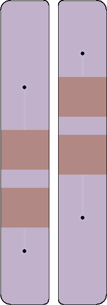
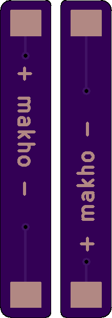
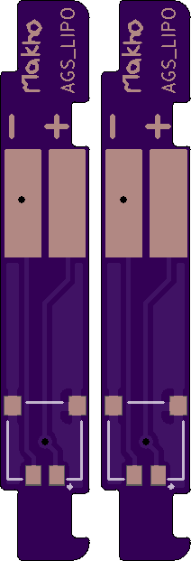
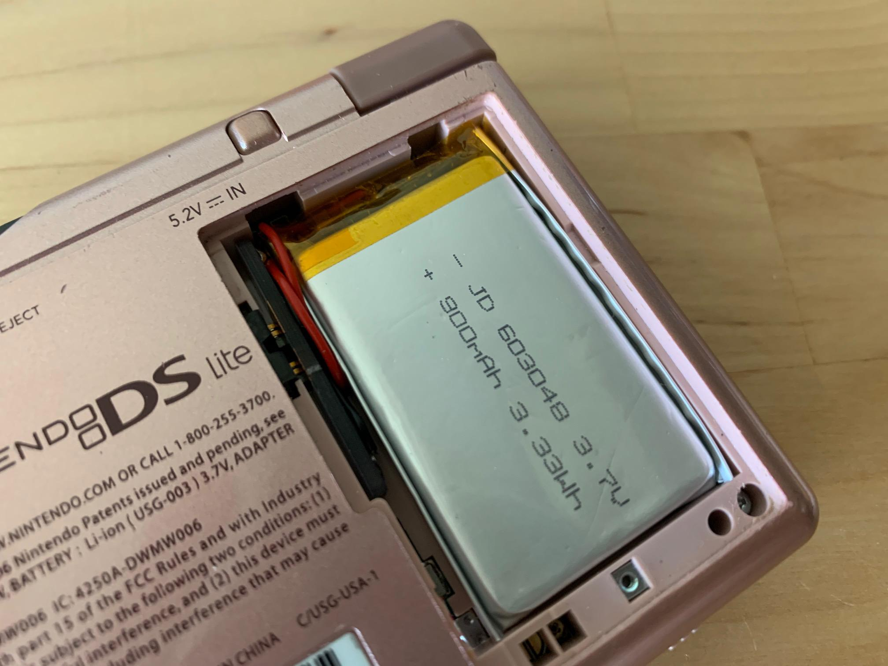

# AGS_LIPO

LiPo adapter for Game Boy Advance SP. The idea behind this design is that the board itself is intended to be slightly oversized so that you may wedge it in the battery compartment against the spring contacts. The battery cell itself should not be structural or load bearing in any way.

One single board does not meet OSHpark's minimum PCB size requirement so I've uploaded two variants of the file, the single, regular version and then the same thing but I copy\pasted the same board into the file. This works for OSHpark but probably will not work for other fabs. 

Works well with 603048 batteries: https://www.aliexpress.com/item/33001664276.html (but there may be higher quality or cheaper options (or both))

# V1.0

Needs no extra parts beyond a battery itself. Order PCBs from OSHpark or download the PCB files here for using with your preferred fab. ENIG is highly recommended for this. [https://oshpark.com/shared_projects/gaB93JkC](https://oshpark.com/shared_projects/gaB93JkC)

Or order straight from RGRS: [https://retrogamerepairshop.com/collections/makho/products/gba-sp-game-boy-advance-sp-rechargeable-850mah-lipo-battery-mod-by-makho](https://retrogamerepairshop.com/collections/makho/products/gba-sp-game-boy-advance-sp-rechargeable-850mah-lipo-battery-mod-by-makho)
* Note that the original "makho battery mod" is no longer available from RGRS as it has been replaced with the spiritual successor from funnyplaying. Consider it v3 ;)

For more info and for the install, see this youtube video: [https://youtu.be/VjnONhSVvpA](https://youtu.be/VjnONhSVvpA)

# V2.0

For more info and for the install, see this youtube video: [https://youtu.be/uIvCC7yzNTQ](https://youtu.be/uIvCC7yzNTQ)

This variant is intended for use with Retromodding's 3D printable bracket: [https://www.thingiverse.com/thing:4624968](https://www.thingiverse.com/thing:4624968)

You can order PCBs here: [https://oshpark.com/shared_projects/hciypfPv](https://oshpark.com/shared_projects/uh1rTSxD)

Purchase one pre-assembled directly from Retromodding: [https://www.retromodding.com/collections/featured-items/products/makho-game-boy-advance-sp-battery](https://www.retromodding.com/collections/featured-items/products/makho-game-boy-advance-sp-battery)
* I'd recommend the [funnyplaying battery](https://retrogamerepairshop.com/collections/makho/products/gba-sp-game-boy-advance-sp-rechargeable-850mah-lipo-battery-mod-by-makho) from RGRS over the RM one linked above. Consider it v3 ;)

Bonus, this battery mod also works perfectly in the original DS (as is) and the DS Lite (rotated) as picture below ([credit](https://www.reddit.com/r/Gameboy/comments/hnpqkj/got_extra_lipos_and_makho_pcbs_fits_well_in_the/) from u/deep_size)

Simply order the v1 version boards and 603048 battery cells and assemble accordingly. There is no "framed" version of this mod for DS Lite. 

