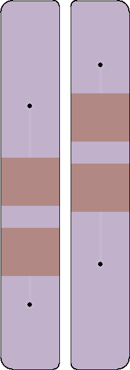
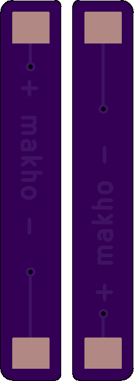

# AGS_LIPO

LiPo adapter for Game Boy Advance SP. Same concept as my AGB adapters: https://github.com/makhowastaken/AGB_LIPO

Update 2020-05-09: Added text to solder mask layer to make markings (positive and negative side) more clear. No other changes made. 

Needs no extra parts beyond a battery itself. Order PCBs from OSHpark or download the PCB files here for using with your preferred fab. ENIG is highly recommended for this. https://oshpark.com/shared_projects/gaB93JkC

One single board does not meet OSHpark's minimum PCB size requirement so I've uploaded two variants of the file, the single, regular version and then the same thing but I copy\pasted the same board into the file. This works for OSHpark but probably will not work for other fabs. 

Works well with 603048 batteries: https://www.aliexpress.com/item/33001664276.html (but there may be higher quality or cheaper options (or both))

For more info and for the install, see this youtube video: https://youtu.be/VjnONhSVvpA

